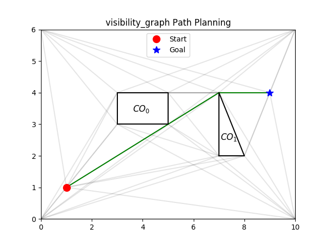
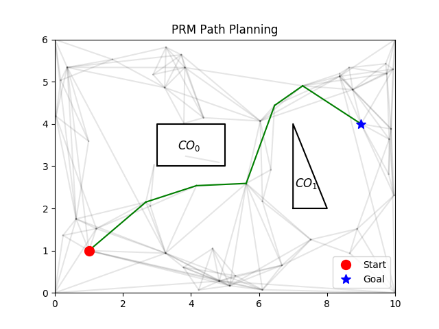
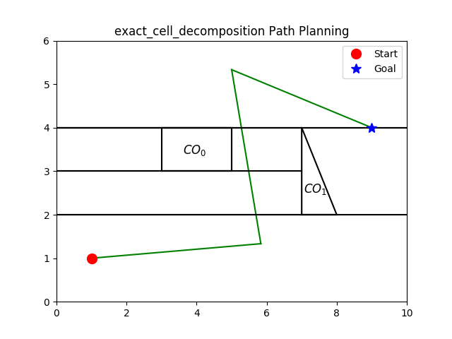
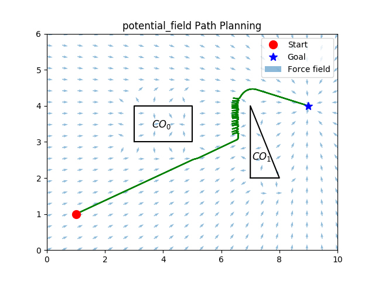

# Path Planning Examples 
Path planniing algorithms to get a "robot" from one point to another while avoiding collisions. 

### Visibility graphs

### PRM

### Exact Cell Decomposition

### Potential Field

